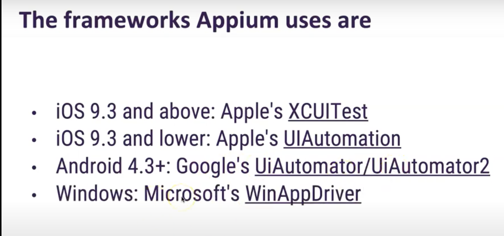
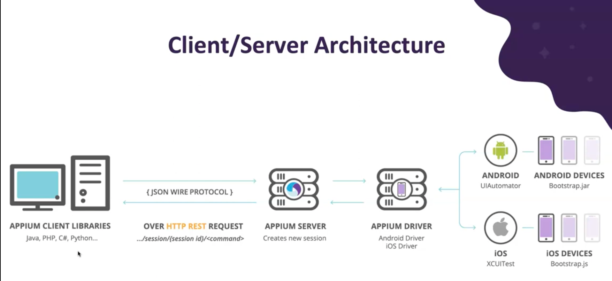
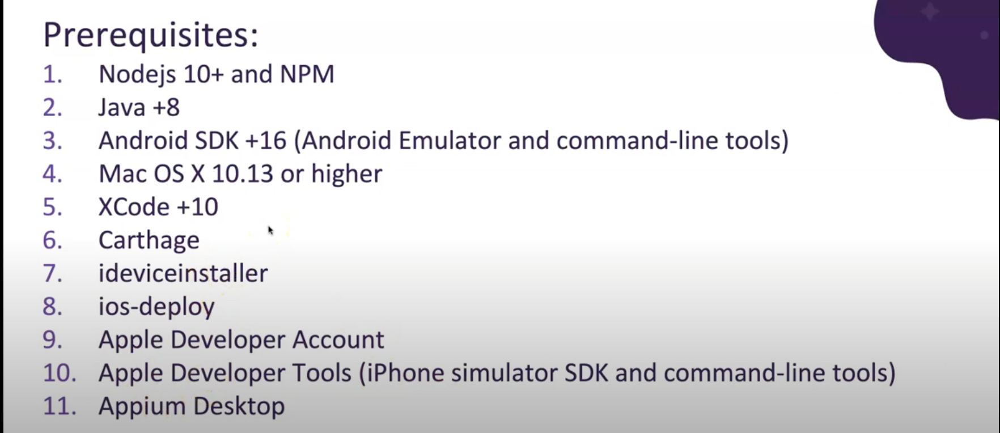
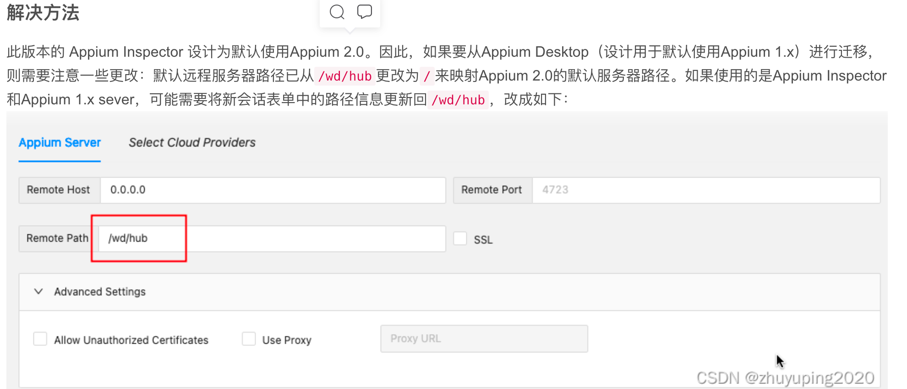
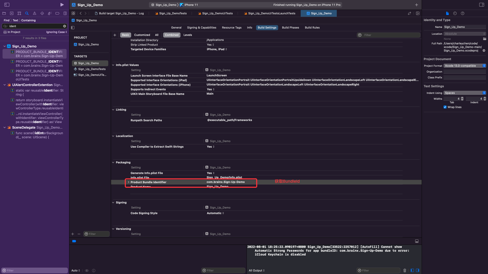

### IOS自动化测试框架

#### 初始化Git环境


echo "# IosAuto" >> README.md  
git init  
git add README.md  
git commit -m "first commit"  
git branch -M master  
git remote add origin https://github.com/kvchs/IosAuto.git  
git push -u origin master  


#### idea无法登录github，错误信息invalid authentication data的终极解决办法。
通过stackoverflow上看见应该是token的问题，就上自己的github上看了一下token，发现有了很多的token，就把已有的全部删除了，然后再次通过IDEA登录github就可以登录了

#### 测试环境搭建
> brew install node      # get node.js  
> npm install -g appium  # get appium  
> npm install wd         # get appium client  
> appium &               # start appium  
> node your-appium-test.js  


#### Machine Setup

1. Install Java Development Kit (JDK) version 7 or above
2. Install Node.js
3. Install Appium from the terminal (skip if you install Appium Desktop)
npm install -g appium
4. Install Appium Desktop (optional)
5. Install Xcode from the Mac App Store

#### The frameworks Appium uses are



#### Installing and Running Appium on MacOS


#### 无法打开“Appium Server GUI”，因为Apple无法检查其是否包含恶意软件。
输入命令：sudo spctl --master-disable（复制粘贴进去）  

回车！然后输入电脑密码回车即可（密码输入是看不见的，无视继续输入），然后再去打开软件即可。

#### 无论是模拟器还是iPhone真机，他们都有唯一的ID，Appium操作iPhone时得知道iPhone的ID才可以，在terminal输入命令
xcrun xctrace list devices  
这条命令会输出所有iPhone虚拟机、真机的ID，我们这里选用的是iPhone 11 Pro Max，可以看到ID为98F01268-1E8B-4E32-8E0D-15ABE02745B1


#### 执行环境搭建教程
https://blog.csdn.net/qq_43576028/article/details/117880023

#### 安装捕获元素工具

https://github.com/appium/appium-inspector  
Appium Inspector: Failed to create session. The requested resource could not be found
https://blog.csdn.net/qq_31362767/article/details/123180809  



```json
{
  "platformName": "iOS",
  "appium:deviceName": "iPhone",
  "appium:platformVersion": "15.5",
  "appium:udid": "E2205BE8-07FB-42F7-B2CA-A2EB2585DA24",
  "appium:bundleId": "mars.demo",
  "appium:xcodeSigningId": "iPhone Developer"
}
```
注:其他参数,app+文件路径


#### 参考文献
https://appium.io/
https://github.com/sham-kumar-brainx/Sign_Up_Demo(XCode测试应用)